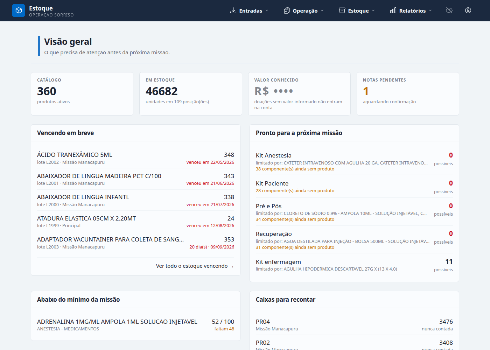
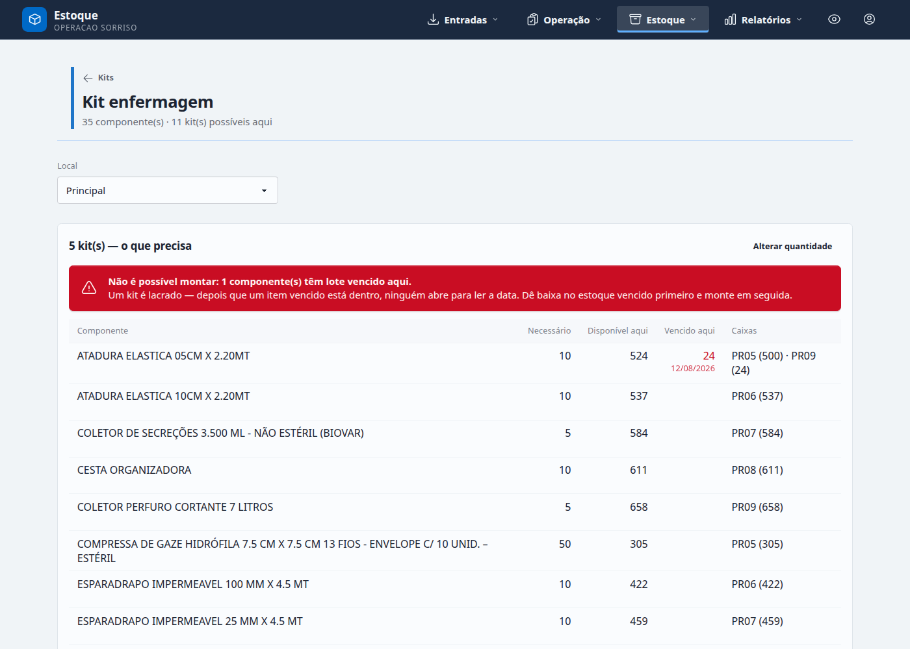
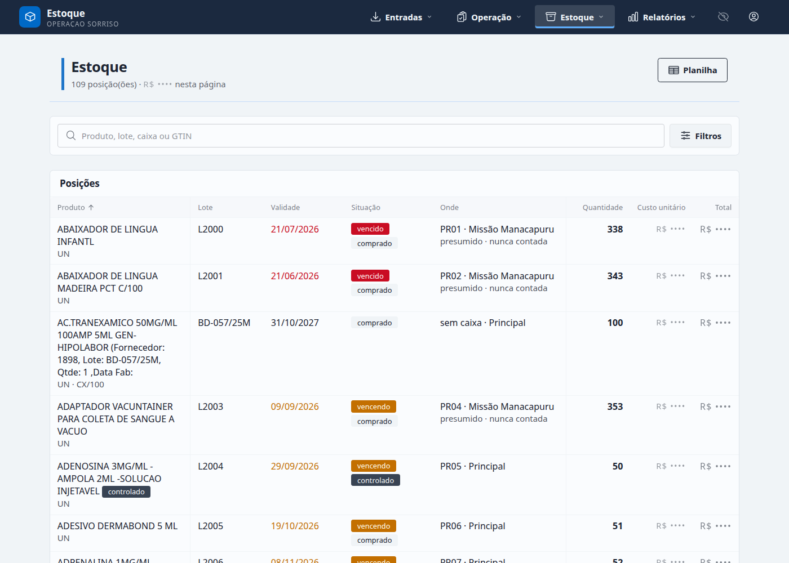

# Estoque OS

Stock control for a surgical NGO that works out of boxes.

**Operação Sorriso do Brasil** runs week-long surgical missions — cleft lip and
palate — in remote Brazilian cities. A mission is planned for four operating
tables, packed into numbered boxes, flown in, partly consumed, partly donated to
the local hospital, and partly flown home. Until now the whole thing lived in
spreadsheets, which cost the supply coordinator more than a week of work per
mission and left one question unanswerable: *what do we have, where is it, in
what state, and who moved it.*

This is the system that answers it. The interface is entirely in Brazilian
Portuguese; the code, schema and these docs are in English.

> **Status:** working prototype, deployed as a demo. Not yet running the real
> operation.



---

## What it does

| | |
|---|---|
| **Ledger** | Stock is an append-only ledger of signed entries. No balance is ever stored or edited — every figure on every screen is derived, and a snapshot table exists only as a cache the same transaction maintains. Every movement has a type, and every adjustment a reason code. Nothing is hard-deleted. |
| **Lots and expiry** | Everything is tracked to the lot. FEFO is the default picking suggestion. A lot with no expiry date is a distinct fact from a lot that never had one, and the product says which to expect. |
| **Boxes** | Boxes are movable containers with their own `last_verified_at`. Moving a box moves its presumed contents — a box travels whole and is not recounted on arrival — so the screens distinguish a counted balance from an inherited one. |
| **NF-e import** | Brazilian electronic invoices (layout 4.00) are parsed, matched against the catalog and posted into the ledger at real unit costs. Lot numbers come from the structured `rastro` group when the supplier ships it, from a regex over `infAdProd` free text when they don't, and are flagged for review when neither works. Correction letters (CC-e) attach to the invoice they correct. |
| **Receiving** | Conference against what the invoice promised, blind or not, in rounds — because the warehouse recounts when a divergence looks like a miscount. |
| **Kits** | A kit is a product. Assembling one converts component lots into a lot of the kit's own product, so the screen that writes off a bandage writes off a kit, and a recall can still trace which component lots went into which kit lot. Assembly is refused outright while any component has expired stock on the shelf — a kit is sealed, and nobody opens one to read a date. |
| **Missions** | One trip at a time in one place, enforced by a Postgres exclusion constraint rather than a check in Elixir — the race it prevents is invisible to application-level validation. Load-out, on-site consumption, donation and return, with stock that goes straight from one mission to the next accounted for as *moved on* rather than lost. |
| **Money** | Four roles. The operator who handles boxes never sees a price, anywhere. Amounts start hidden even for those who may see them: revealing is the deliberate act. |
| **Reports** | Product history, stock export to Excel, and the donation certificate a hospital signs. |

Assembling a kit, refused because one component has expired stock here. The
count and the date are on the offending row; the column is rendered on every row
so nothing shifts under a thumb already on the next line:



The stock list, which separates a balance that was counted from one that was
inherited from a box that travelled:



## Running it locally

Needs Docker and [mise](https://mise.jdx.dev) (or asdf — the versions are in
`.tool-versions`).

```bash
docker compose up -d          # Postgres on 5433
mix setup                     # deps, database, catalog seeds, assets
mix dev.seeds                 # the demo scenario: stock, invoices, missions
mix phx.server
```

Then open http://localhost:4000 and log in as `admin@exemplo.org` with the
password `mix dev.seeds` prints.

One account, deliberately. Creating the others is the first thing an
administrator does on a fresh install, and it is a flow worth walking rather
than seeding around — the temporary password, the forced change on first login,
and the role that decides whether prices are visible at all. `/admin/users` is
where it happens.

| Role | Sees |
|---|---|
| admin | everything, plus who gets an account |
| manager | the whole operation, money included |
| logistics | boxes, counts, load-outs, returns. No prices, anywhere |
| auditor | everything, money and ledger included. Writes nothing |

`mix precommit` runs what CI runs: format, unused deps, advisories, warnings as
errors, Credo (strict), Sobelow, and the tests.

## Tests

830 of them, including the ledger invariants and the NF-e parser, which are the
two highest-value targets in the codebase.

```bash
mix test
```

The parser is checked against the two sample invoices in `priv/samples/` —
fictional companies, genuine NF-e 4.00 structure, one with a `rastro` group and
one with lot data only in free text.

## Deploying the demo

Sized for the [Gigalixir](https://gigalixir.com) free tier: one replica, 0.5 GB
of memory, and a database with two connections and a ten thousand row ceiling.
The seeded demo scenario settles near fourteen hundred rows.

The release builds its own assets, so `MIX_ENV=prod mix release` produces a
complete, servable release locally — which is how to check a deploy before
making it.

```bash
pip3 install gigalixir --user
gigalixir login
gigalixir create -n estoque-os
gigalixir pg:create --free
gigalixir account:ssh_keys:add "$(cat ~/.ssh/id_ed25519.pub)"

gigalixir config:set SECRET_KEY_BASE="$(mix phx.gen.secret)"
gigalixir config:set PHX_HOST=estoque-os.gigalixirapp.com
gigalixir config:set PHX_SERVER=true
gigalixir config:set POOL_SIZE=2

git push gigalixir main
```

Migrations run before the web server starts, from `rel/overlays/Procfile`, so a
deploy that cannot migrate never comes up serving the old schema. The data is
loaded once, afterwards:

```bash
# locations, 322 products, 5 kits — safe to run more than once
gigalixir run bin/estoque_os eval 'EstoqueOS.Release.seed()'

# boxes, stock, two invoices, assembled kits, missions, the admin account
# — refuses to run twice, because it would double every balance
gigalixir run bin/estoque_os eval 'EstoqueOS.Release.demo()'
```

`gigalixir ps:remote_console` gets you an IEx prompt on the running node if you
would rather watch it happen. `gigalixir ps` shows status, `gigalixir logs`
tails.

### Configuration

| Variable | Default | |
|---|---|---|
| `DATABASE_URL` | — | required |
| `SECRET_KEY_BASE` | — | required; `mix phx.gen.secret` |
| `PHX_HOST` | `example.com` | the public hostname |
| `POOL_SIZE` | `2` | the free tier allows two connections in total |
| `EMAIL_ENABLED` | `false` | see below |
| `ORGANIZATION_DOCUMENT` | placeholder | printed on donation certificates |
| `ORGANIZATION_ADDRESS` / `_CONTACT` / `_NAME` | placeholder | same |
| `DATABASE_CA_CERT_FILE` | — | when the database sits behind a private CA |
| `DATABASE_SSL_VERIFY` | `peer` | `none` to skip verification. Shouts on boot |

**Email is off by default, and production leaves it off.** Accounts are handed
out by an administrator with a temporary password, so nothing about getting in
depends on a message arriving — which means a deployment with no mailer is a
supported deployment rather than a broken one, and the demo needs no sending
domain and no outbound provider. The flows that can only work by email — the
magic link, "esqueci minha senha", confirming a changed address — are grouped
behind one gate and answer with an explanation instead of a form that leads
nowhere. Turning them back on is `EMAIL_ENABLED=true` plus a Swoosh adapter;
they are intact and tested, not deleted.

## Layout

```
lib/estoque_os/          contexts: Accounts, Catalog, Inventory, Invoices,
                         Kits, Missions, Outbound, Receiving, Reports
lib/estoque_os_web/live/ one directory per screen
priv/repo/migrations/    seven, one per context
priv/samples/            the fiscal documents and spreadsheets the seeds and
                         the parser tests read
docs/SPEC.md             the source of truth for domain and design decisions
PRODUCT.md               who this is for and what it must not become
```

## A note on the sample data

The two NF-e, the correction letter and both spreadsheets came from the real
operation. Because this repository is public, every party in them was
replaced — companies, registrations, addresses, contacts, the embedded signing
certificates — and the history was rewritten so it never contained the
originals. What survives is the shape: the tax groups, the two different places
a supplier hides a lot number, the missing NCMs, the sector typed both
`CRASHBOX` and `CRASHBIX`, and the spreadsheet range reference pasted into the
middle of a word. That mess is the specification.
